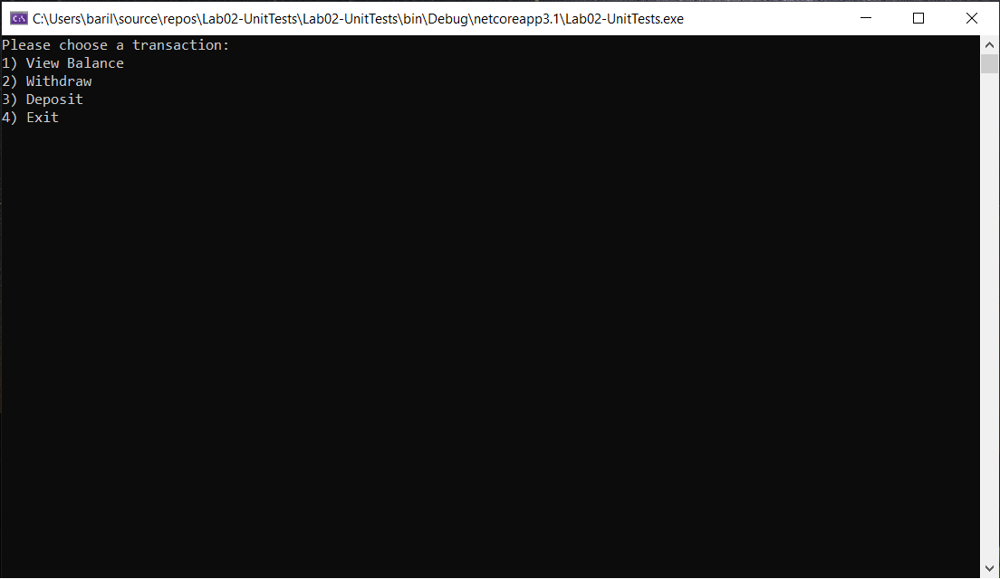

## ATM Console Application

Lab: 02 - Unit Tests & Documentation

*Author: Na'ama Bar-Ilan*

----

## Description
This is a bank “ATM” program within a C# console application. The console application mocks the functionality of an ATM: view the current balance, withdraw money from the balance and deposit money to the current balance.
The application has a user interface that prompts the user for these standard ATM operations and unit tests for the functionality. 

---

### Getting Started
Clone this repository to your local machine.

```
$ git clone [repo clone url here]
```

### To run the program from Visual Studio:
Select ```File``` -> ```Open``` -> ```Project/Solution```

Next navigate to the location you cloned the Repository.

Double click on the ```Lab02-UnitTests``` directory.

Then select and open ```Lab02-UnitTests.sln```

---

### Visuals

#### Application Start

#### View Balance and Withdraw

#### View Balance and Deposit


---

### Change Log
 
